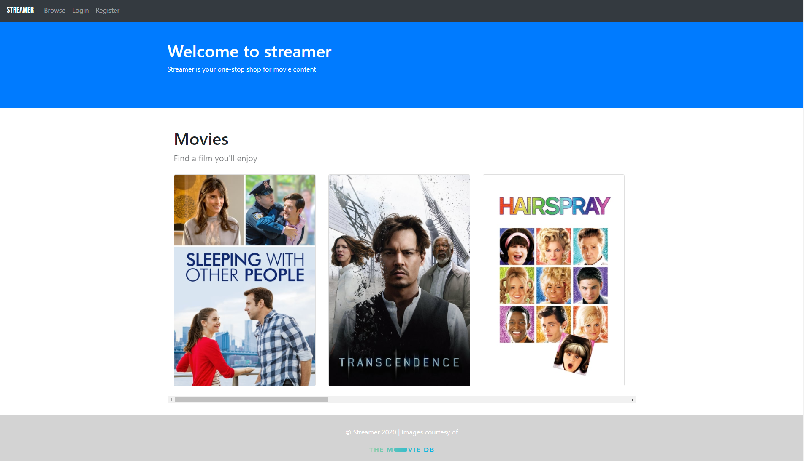
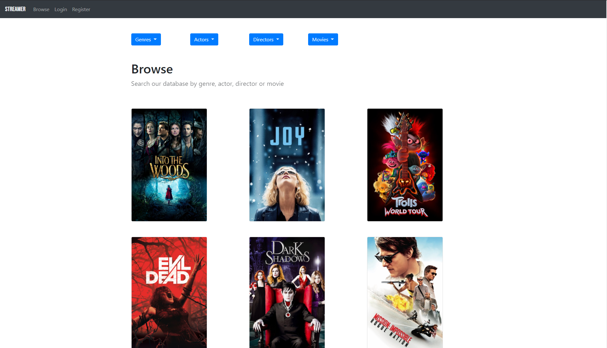
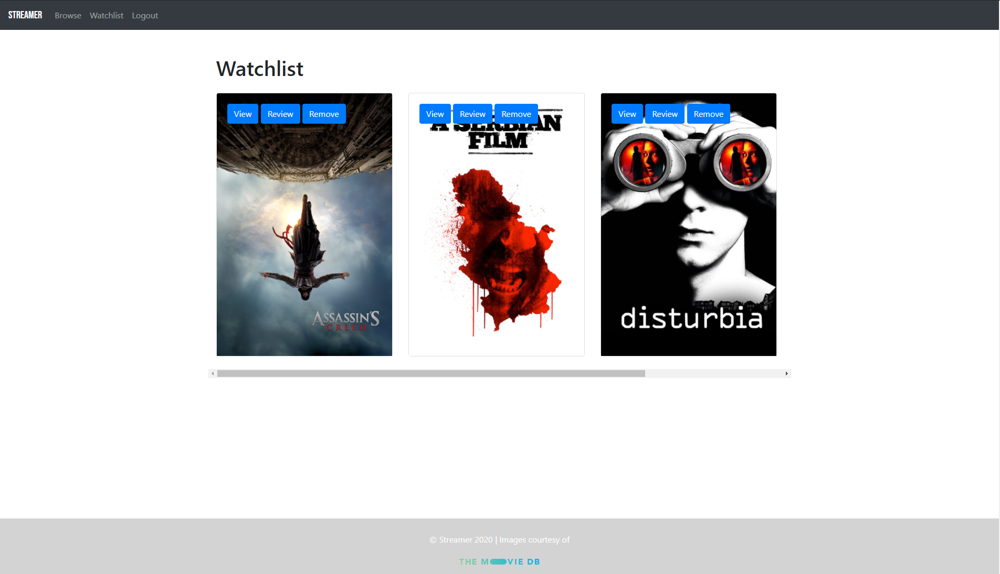

# streamer

## Description

A web application that allows users to:

* Browse movies
* Search movies by genres, actors, and directors
* See reviews for movies
* Create a login
* Add reviews for movies
* Save movies to/remove movies from a personal watchlist

## Screenshots






## Installation

**Installation via requirements.txt**

```shell
$ cd streamer
$ py -3 -m venv venv
$ venv\Scripts\activate
$ pip install -r requirements.txt
```

When using PyCharm, set the virtual environment using 'File'->'Settings' and select 'Project:streamer' from the left menu. Select 'Project Interpreter', click on the gearwheel button and select 'Add'. Click the 'Existing environment' radio button to select the virtual environment. 

## Execution

**Running the application**

From the *streamer* directory, and within the activated virtual environment (see *venv\Scripts\activate* above):

````shell
$ flask run
```` 


## Configuration

The *streamer/.env* file contains variable settings. They are set with appropriate values.

* `FLASK_APP`: Entry point of the application (should always be `wsgi.py`).
* `FLASK_ENV`: The environment in which to run the application (either `development` or `production`).
* `SECRET_KEY`: Secret key used to encrypt session data.
* `TESTING`: Set to False for running the application. Overridden and set to True automatically when testing the application.
* `WTF_CSRF_SECRET_KEY`: Secret key used by the WTForm library.


## Testing

Testing requires that file *streamer/tests/conftest.py* be edited to set the value of `TEST_DATA_PATH`. You should set this to the absolute path of the *streamer/tests/data* directory. 

E.g. 

`TEST_DATA_PATH = os.path.join('C:', os.sep, 'Users', 'marjo', 'iCloudDrive', 'University', 'COMPSCI 235', 'A2', 'streamer', 'tests', 'data')`

assigns TEST_DATA_PATH with the following value (the use of os.path.join and os.sep ensures use of the correct platform path separator):

`C:\Users\marjo\iCloudDrive\University\COMPSCI 235\A2\streamer\tests\data`

You can then run tests from within PyCharm.

You can also run tests from the *streamer* directory, and within the activated virtual environment (see *venv\Scripts\activate* above):

````shell
$ python -m pytest
````  
